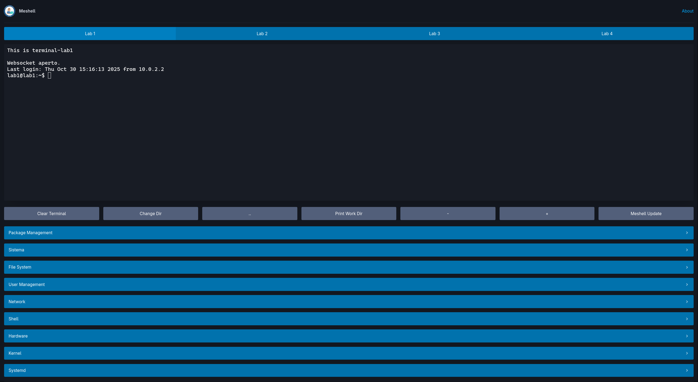

<p align="center">
  
</p>

<h1 align="center">Meshell</h1>

<p align="center">
  
  
  
  
  
</p>

<p align="center">
  <strong>A versatile and powerful tool for managing remote machines and executing commands.</strong>
</p>

<p align="center">
  <a href="#about-meshell">About</a> •
  <a href="#features">Features</a> •
  <a href="#gallery">Gallery</a> •
  <a href="#technologies-used">Technologies</a> •
  <a href="#getting-started">Getting Started</a> •
  <a href="#usage">Usage</a> •
  <a href="#contributing">Contributing</a> •
  <a href="#license">License</a>
</p>

---

## About Meshell

Meshell is a comprehensive solution for developers and system administrators who need to manage multiple remote machines efficiently. It provides both a web-based SSH terminal and a powerful command-line interface (CLI) to streamline your workflow.

The project consists of two main components:

*   **Web-based SSH Terminal**: A Go-based web server that provides a beautiful and intuitive web interface for accessing remote machines via SSH. It uses WebSockets for real-time communication and `xterm.js` for a fully-featured terminal experience in your browser.
*   **Command-Line Interface (CLI)**: A feature-rich Bash script (`meshell.sh`) that offers a wide range of commands for managing virtual machines, interacting with the system, and performing various administrative tasks.

## Features

### Web-based SSH Terminal

*   **Multi-Tab Interface**: Easily switch between multiple remote sessions with a clean and intuitive tabbed interface.
*   **Predefined Command Buttons**: Execute common commands with a single click using the predefined command buttons, categorized for ease of use (System, File System, Network, Shell).
*   **Real-time Interaction**: Experience a smooth and responsive terminal session thanks to the use of WebSockets.
*   **Modern UI**: A clean and modern user interface built with Pico.css.

### Command-Line Interface (`meshell.sh`)

*   **VM Management**: Start, stop, and list VirtualBox virtual machines.
*   **Interactive Commands**: An extensive set of interactive commands for system administration.
*   **Italian Language Support**: All interactive prompts and messages are in Italian.
*   **Extensible**: Easily add new commands to the script.

## Gallery

<p align="center">
  
</p>

## Technologies Used

*   **Go**: The backend web server is written in Go.
*   **WebSockets**: Used for real-time communication between the web interface and the server.
*   **xterm.js**: A JavaScript library for creating a terminal in the browser.
*   **Pico.css**: A lightweight CSS framework for styling the web interface.
*   **Bash**: The command-line interface is a Bash script.
*   **Docker**: Used for containerizing the application.

## Getting Started

### Prerequisites

*   [Go](https://golang.org/doc/install)
*   [Node.js and npm](https://nodejs.org/en/download/)
*   [VirtualBox](https://www.virtualbox.org/wiki/Downloads) (for VM management)
*   A modern web browser

### Installation

1.  **Clone the repository:**

    ```bash
    git clone https://github.com/meshell-dev/meshell.git
    cd meshell
    ```

2.  **Install Go dependencies:**

    ```bash
    go mod tidy
    ```

3.  **Install npm dependencies:**

    ```bash
    npm install
    ```

4.  **Make the `meshell.sh` script executable:**

    ```bash
    chmod +x meshell.sh
    ```

## Usage

### Web-based SSH Terminal

1.  **Start the web server:**

    ```bash
    npm start
    ```

2.  **Open your web browser and navigate to `http://localhost:8080`.**

### Command-Line Interface (`meshell.sh`)

The `meshell.sh` script provides a wide range of commands. To see the available commands, run:

```bash
./meshell.sh --h
```

To execute a specific command, use the `--cmd` flag. For example, to see the system's uptime:

```bash
./meshell.sh --cmd uptime
```

### Featured Commands
| Command | Description |
| --- | --- |
| `meshell-update` | Aggiornado Meshell |
| `ls` | Eseguendo 'ls -la': Elenca i file e le directory con i dettagli. |
| `inode` | Eseguendo 'ls -ll': Elenca i file e le directory con i dettagli e gli inode. |
| `uptime` | Eseguendo 'uptime -p': Mostra da quanto tempo il sistema è attivo. |
| `free` | Eseguendo 'free -h': Mostra l'utilizzo della memoria in formato leggibile. |
| `ps` | Eseguendo 'ps aux --forest': Mostra i processi in esecuzione in una struttura ad albero. |
| `w` | Eseguendo 'w': Mostra chi è loggato e cosa sta facendo. |
| `last` | Eseguendo 'last -n 10': Mostra gli ultimi 10 login. |
| `df` | Eseguendo 'df -hT': Mostra l'utilizzo dello spazio su disco in formato leggibile. |
| `id` | Eseguendo 'id': Mostra l'ID dell'utente e del gruppo. |
| `whoami` | Eseguendo 'whoami': Mostra l'utente corrente. |
| `shutdown` | Eseguendo 'shutdown': Arresta il sistema. |
| `reboot` | Eseguendo 'reboot': Riavvia il sistema. |
| `top` | Eseguendo 'top': Mostra i processi in esecuzione e l'utilizzo delle risorse. |
| `kill` | Inserisci l'ID del processo da terminare: |
| `update` | Eseguendo 'sudo apt update && sudo apt upgrade': Aggiorna l'elenco dei pacchetti e aggiorna i pacchetti installati. |
| `install` | Inserisci il nome del pacchetto da installare: |
| `search` | Inserisci il nome del pacchetto da cercare: |
| `remove` | Inserisci il nome del pacchetto da rimuovere: |
| `touch` | Inserisci il nome del file da creare: |
| `tree` | Eseguendo 'tree': Mostra la struttura delle directory ad albero. |
| `ln` | Inserisci il percorso di destinazione: |
| `umask` | Eseguendo 'umask': Mostra la maschera di creazione dei file dell'utente. |
| `chmod` | Inserisci i permessi (es. 755): |
| `chown` | Inserisci il nuovo proprietario: |
| `ping` | Inserisci l'host da pingare: |
| `wget` | Inserisci l'URL da scaricare: |
| `curl` | Inserisci l'URL da scaricare: |
| `ip` | Eseguendo 'ip -a': Mostra le informazioni sull'interfaccia di rete. |
| `netcat` | Inserisci l'host a cui connettersi: |
| `portmap` | Eseguendo 'portmap': Mostra le informazioni sulla mappatura delle porte RPC. |
| `dig` | Inserisci il dominio da interrogare: |
| `host` | Inserisci il dominio o l'indirizzo IP da interrogare: |
| `nslookup` | Inserisci il dominio da interrogare: |
| `which` | Inserisci il nome del comando: |
| `find` | Inserisci il percorso in cui cercare: |
| `type` | Inserisci il nome del comando: |
| `file` | Inserisci il nome del file: |
| `alias` | Inserisci il nome dell'alias: |
| `alias-remove` | Inserisci il nome dell'alias da rimuovere: |
| `mkdir` | Inserisci il nome della cartella da creare: |
| `useradd` | Inserisci il nome utente da creare: |
| `userdel` | Inserisci il nome utente da eliminare: |
| `groupadd` | Inserisci il nome del gruppo da creare: |
| `groupdel` | Inserisci il nome del gruppo da eliminare: |
| `usermod` | Inserisci il nome utente da modificare: |
| `history` | Eseguendo 'history': Mostra la cronologia dei comandi. |
| `date` | Eseguendo 'date': Mostra la data e l'ora correnti. |
| `cal` | Eseguendo 'cal': Mostra il calendario. |
| `weather` | Eseguendo 'curl wttr.in': Mostra le condizioni meteorologiche correnti. |
| `uname` | Eseguendo 'uname -a': Mostra le informazioni di sistema. |
| `du` | Eseguendo 'du -h': Mostra l'utilizzo dello spazio su disco in formato leggibile. |
| `vm_stat` | Eseguendo 'vm_stat': Mostra le statistiche sulla memoria virtuale. |
| `ifconfig` | Eseguendo 'ifconfig': Mostra le informazioni sull'interfaccia di rete. |
| `netstat` | Eseguendo 'netstat -an': Mostra le connessioni di rete, le tabelle di routing, le statistiche dell'interfaccia, le connessioni mascherate e le appartenenze multicast. |
| `route` | Eseguendo 'netstat -r': Mostra la tabella di routing IP. |
| `arp` | Eseguendo 'arp -a': Mostra la tabella ARP. |
| `psu` | Eseguendo 'ps -u $USER': Mostra i processi dell'utente corrente. |
| `sar` | sar could not be found |
| `lsof` | lsof could not be found |
| `lshw` | lshw could not be found |
| `lsblk` | lsblk could not be found |
| `lspci` | lspci could not be found |
| `lsusb` | lsusb could not be found |
| `lsmod` | Eseguendo 'lsmod': Mostra i moduli del kernel. |
| `dmesg` | Eseguendo 'dmesg': Mostra i messaggi del kernel. |
| `journalctl` | Eseguendo 'journalctl': Mostra il journal di sistema. |
| `systemctl` | Eseguendo 'systemctl': Mostra lo stato dei servizi di sistema. |
| `timers` | Eseguendo 'systemctl list-timers': Mostra i timer di sistema. |
| `sockets` | Eseguendo 'systemctl list-sockets': Mostra i socket di sistema. |
| `targets` | Eseguendo 'systemctl list-units --type=target': Mostra i target di sistema. |
| `devices` | Eseguendo 'systemctl list-units --type=device': Mostra i device di sistema. |
| `mounts` | Eseguendo 'systemctl list-units --type=mount': Mostra i mount di sistema. |
| `automounts` | Eseguendo 'systemctl list-units --type=automount': Mostra gli automount di sistema. |

## Contributing

Contributions are welcome! If you have any ideas, suggestions, or bug reports, please open an issue or submit a pull request.

## License

This project is licensed under the MIT License - see the [LICENSE](LICENSE) file for details.